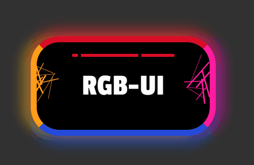
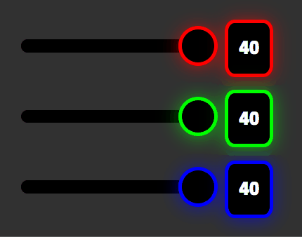
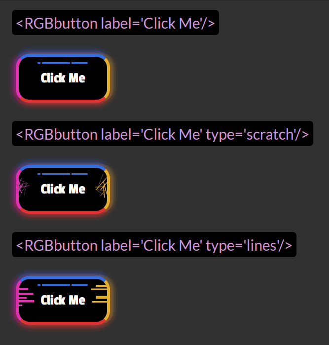

> A React UI library inspired by RGB style flashy lights that best suits the dark theme.


## Install

```bash
npm install --save rgb-ui
```


## Components
### 1. RGBslider
A rgb-ui variant of a input range slider.  
<b>Props</b>: min(number) max(number) step(number) value(number) onChange(function) type(string = 'red'||'green'||'blue').  
All three variants of the RGBslider(red, green or blue) can be accessed through the type prop.

### 2. RGBchip
A rgb-ui variant of a chip to display data.  
<b>Props</b>: label(number or string) type(string = 'red'||'green'||'blue').  
All three variants of the RGBchip(red, green or blue) can be accessed through the type prop.  

Example usage:    
  

Example code:  
```jsx
      <div className='rangecontainer'>
        <RGBslider
          type='red'
          min={0}
          max={40}
          value={input}
          onChange={handleRangeChange}
        />
        <RGBchip label={input} type='red' />
      </div>
      <div className='rangecontainer'>
        <RGBslider
          type='green'
          min={0}
          max={40}
          value={input2}
          onChange={handleRangeChange2}
        />
        <RGBchip label={input2} type='green' />
      </div>
      <div className='rangecontainer extrabottommargin'>
        <RGBslider
          type='blue'
          min={0}
          max={40}
          step={10}
          value={input3}
          onChange={handleRangeChange3}
        />
        <RGBchip label={input3} type='blue' />
      </div>
```


### 3. RGBbutton
<b>Props</b>: label(string | number) type(string = 'scratch'||'lines')(optional)

Example usage:    
  


You can include your own css classnames to override the styles.  
For example, you can override the button styles by passing the classname to the RGBbutton component:  
```jsx
<RGBbutton label="Click Me" className="customClass"/>  
```

However for few properties such as font-size, background-color of the button,use either the !important rule for your property:  
```css
.customClass{
font-size:25px !important;
}
```  

 Or use classname with high specificity, such as including atleast one selector before your classname.  
Eg:  
```css
div .customClass{
font-size:25px;
}
```  


## License

MIT © [reel-pre](https://github.com/reel-pre)
