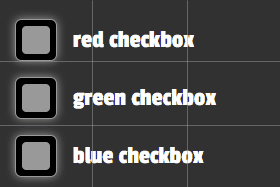

> A React UI library inspired by RGB style flashy lights that best suits the dark theme.

## Install

```bash
npm install --save rgb-ui
```

## Import
Components can be imported from rgb-ui using named import. You also need to import the css file for rgb-ui.
```jsx
import { RGBbutton, RGBslider, RGBchip, RGBcheckbox, RGBskeleton } from 'rgb-ui'
import 'rgb-ui/dist/index.css'
```  
## Complete usage code:  
https://github.com/reel-pre/rgb-ui/blob/main/example/src/App.js

# Components(API and Example usage):

## 1. RGBbutton
A rgb-ui variant of a button.


<b>Prop-name(type)</b>:

label(number or string), type(string = 'red'||'green'||'blue'), onClick(function), className(string).  
All three variants of the RGBbutton(red, green or blue) can be accessed through the type prop.   


Example usage:  


Example code:
```jsx
<RGBbutton
type='blue'
label='Subscribe'
onClick={() => {}}
/>
```

## 2. RGBinput
A rgb-ui variant of a text input.


<b>Prop-name(type)</b>:

value(string), type(string = 'red'||'green'||'blue'), onChange(function), className(string).  
All three variants of the RGBinput(red, green or blue) can be accessed through the type prop.   


Example usage:  


Example code:
```jsx
<RGBinput
className=''
type='blue'
value={inputText}
onChange={(e) => {
setInputText(e.target.value)
}}
/>
```

## 3. RGBalert
A rgb-ui variant of alert component.


<b>Prop-name(type)</b>:

label(string), type(string = 'red'||'green'||'blue').  
All three variants of the RGBalert(red, green or blue) can be accessed through the type prop.   
red=error | green=success | blue=info

Example usage:  


Example code:
```jsx
<RGBalert
type='red'
label='An error occured and we are working on it to see what went wrong !'
/>
```


## 4. RGBslider

A rgb-ui variant of a input range slider.

<b>Prop-name(type)</b>:

min(number), max(number), step(number), value(number), onChange(function), type(string = 'red'||'green'||'blue'), className(string).  
All three variants of the RGBslider(red, green or blue) can be accessed through the type prop.

## 5. RGBchip

A rgb-ui variant of a chip to display data.

<b>Prop-name(type)</b>:

label(number or string), type(string = 'red'||'green'||'blue'), className(string), onClick(function), value(number).  
All three variants of the RGBchip(red, green or blue) can be accessed through the type prop.

Example usage(RGBslider and RGBchip):  


Example code:

```jsx
  const [input, setInput] = useState(40)
  const handleRangeChange = (e) => {
    setInput(e.target.value)
  }
return <div className='rangecontainer'>
        <RGBslider
          type='red'
          min={0}
          max={40}
          value={input}
          onChange={handleRangeChange}
        />
        <RGBchip label={input} type='red' />
      </div>;
```
## 6. RGBcheckbox
A rgb-ui variant of a checkbox input.


<b>Prop-name(type)</b>:

label(number or string), type(string = 'red'||'green'||'blue'), onClick(function), checkstate(boolean).  
All three variants of the RGBcheckbox(red, green or blue) can be accessed through the type prop.   


Example usage:  



Example code:
```jsx
const [checkbox, setCheckbox] = useState(false)
return <RGBcheckbox
        label='red checkbox'
        type='red'
        checkstate={checkbox}
        onClick={() => {
          setCheckbox((prevState) => !prevState)
        }}
      />;
```

## 7. RGBskeleton
A rgb-ui variant of loading skeleton.


<b>Prop-name(type)</b>:

width(string = CSS property of width in px,%,vw,vh  etc. Ex. 10px), height(string = CSS property of height in px,%,vw,vh  etc. Ex. 15%), type(string = 'red'||'green'||'blue'),
className(string) .  
All three variants of the RGBskeleton(red, green or blue) can be accessed through the type prop.   

Example usage:  
1. Green variant:  
  


2. Red,Green and Blue variant together:  
  


Example code:
```jsx
      <div className='skeltonHolder'>
        <RGBskeleton height='30px' width='30px' type='red' />
        <RGBskeleton height='45px' width='100%' type='red' />
        <RGBskeleton height='15px' width='100%' type='red' />
        <RGBskeleton height='5px' width='100%' type='red' />
        <RGBskeleton height='5px' width='100%' type='red' />
      </div>
```


You can include your own css classnames to override the styles.  
For example, you can override the button styles by passing the classname to any component:

```jsx
<RGBbutton label='Click Me' className='customClass' />
```

However for few properties such as font-size, background-color of the button,use either the !important rule for your property:

```css
.customClass {
  font-size: 25px !important;
}
```

Or use classname with high specificity, such as including atleast one selector before your classname.  
Eg:

```css
div .customClass {
  font-size: 25px;
}
```

## License

MIT © [reel-pre](https://github.com/reel-pre)
